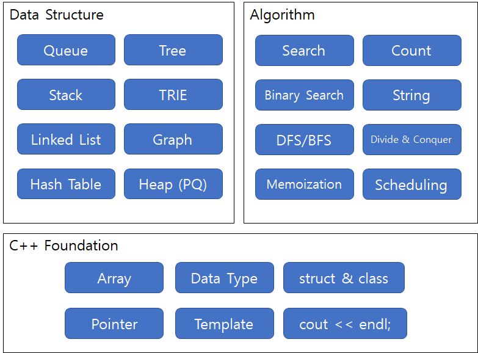

# GoPro - SW Certifiate quick guide

진짜 시작부터 가는 써티 프로따기 가이드.

|Week | Title                        | Theme                                  |
|:---:|:-----------------------------|:---------------------------------------|
| 1   | cpp과 친해지기               | setup, statement, type, pointer        |
| 2   | struct 공략하기              | struct, class, typedef, data structure |
| 3   | 자료구조를 만들어보자 part 1 | queue, stack, list                     |
| 4   | 자료구조를 만들어보자 part 2 | tree, graph                            |
| 5   | 자료구조를 만들어보자 part 3 | hash table, heap(priority queue)       |
| 6   | 알고리즘을 적용해보자 part 1 | |

